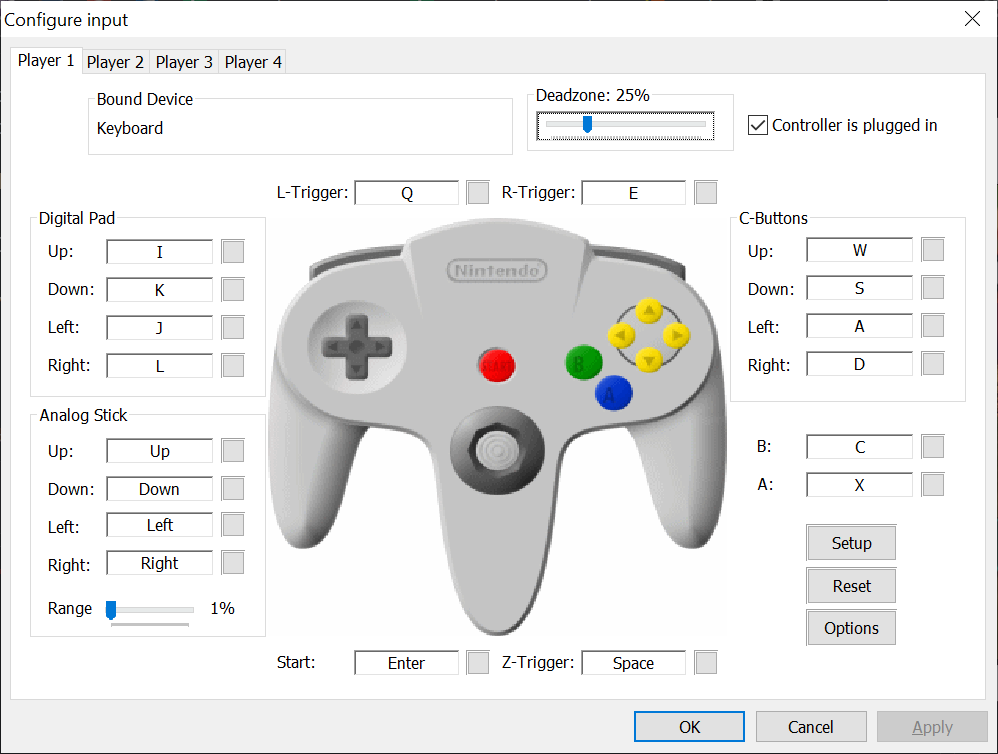

# Bot Installation and Setup Guide

Follow these steps to install and run the bot for playing Super Smash Bros. Melee with Slippi:

## Step 1: Slippi Launcher

Download and install the Slippi Launcher from [slippi.gg](https://slippi.gg).

## Step 2: Download ISO Image

Download the game's ISO image from [vimm.net](https://vimm.net/vault/7818).

## Step 3: Replace Gecko Code File

Replace the `GALE01r2.ini` Gecko code file in your Slippi Dolphin with the one provided in the this repository.

#

### Notes:

you can check the files location opening slippi launcher, going to settings, and clicking on the "netplay" tab under Dolphin settings and hitting the `open settings folder` button

on Mac the location of this files is inside the `Slippi Dolphin.app` package, that is located in the `netplay` folder inside the `slippi launcher` folder inside the `Application support` folder, i.e. `/Library/Application Support/Slippi Launcher/netplay/Slippi Dolphin.app/Contents/Resources/GameSettings`, either in the root directory or the user directory

on windows is elsewere

to check the location of this file, open the Slippi Dolphin Launcher, go to settings, and click on the "netplay" tab under Dolphin settings

## Step 4: Create a .env File Set Environment Variables

Create a `.env` file to store your environment variables and set the following environment variables:

- `DOLPHIN_EXEC_PATH` to your Slippi Dolphin executable path.
- `ISO_PATH` to the location of your game's `.ciso` file.

## Step 5: Install libmelee

Install the `libmelee` library by running the following command:

```bash
   pip install libmelee
```

## Step 6: Install dotenv

Install the `dotenv` library by running the following command:

```bash
   pip install python-dotenv
```

## Step 7: Run the game

Run the game by running the following command:

```bash
   python run_game.py
```

## Keyboard Controller Setup

If you want to play against the bot, you can set up a keyboard controller.

###### Note: there is no Need to install GC adapter drivers for this to work

The button mapping configuration can be found in the `run_game` script and is based on the provided image.



# Development Notes

**IMPORTANT**: When developing your bot be sure Not to push chages for the `run_game.py` and the `bot.py` scripts, as this will cause git conflicts when pulling updates from the repository. this should be used as a base for the bot development, the `run_game.py` script is used to run the game and the `bot.py` script is used as the base for the bot development.

for the developing your bot you should create a new script and import the `bot.py` script, then create a new class that inherits from the `Bot` class and override the `play` method to implement your bot logic.

for additional information on the libmellee options be sure to check the [libmelee documentation](https://libmelee.readthedocs.io/)

That's it! You should now have the environment set up and configured to play Super Smash Bros. Melee with Slippi, and run the bot.

# Happy smashing!
